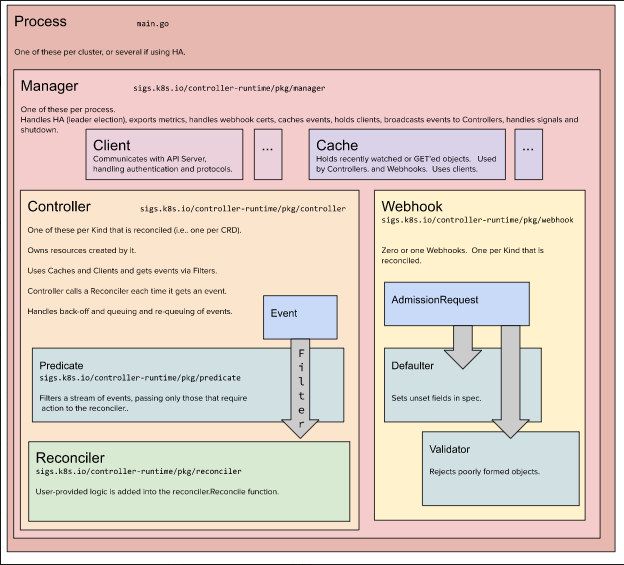

# kubebuilder 架构图


# GVK、GVR
GVK:
* Group(组)
* Version(版本)
* Kind(类型)

GVR:
* Group(组)
* Version(版本)
* Resource(资源)

# 初始化项目
1. 初始化 kubebuilder
```shell
# init 创建必要的基础代码，包括项目的目录结构、Makefile、Dockerfile、CRD、Controller 等
kubebuilder init --domain candy-box.top
```
2. 创建 API
```shell
# create api 创建 API 资源，包括 API 的类型、版本、组、字段等
kubebuilder create api --group demo --version v1 --kind App
```

3. 生成代码
```shell
make generate
```
4. 生成 WebhookConfiguration、ClusterRole 和 CustomResourceDefinition 对象
```shell
make manifests
```

5. 生成 Docker 镜像ls
```shell
make docker-build docker-push IMG=registry.cn-hangzhou.aliyuncs.com/zhengqingya/operator-app:v1
```

6. 部署 CRD
```shell
make install
```

# hack 目录
```text
会给所生成的代码加上头部信息，每个代码文件最上方的注释信息
```

